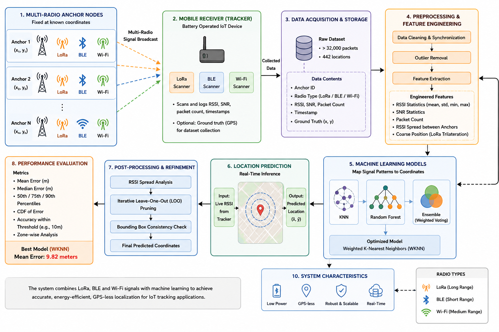

<h1>A Real-Time GPS-less Hybrid Localization System for IoT Battery Operated Tracking Applications</h1>

<p>
  
  
  
  
  
  
  
  
</p>

> ### Electronics & Computer Engineering — VIT Chennai, April 2026  
> **Adithya Ajikumar • Joseph Alex Valluvassery • S Saran**

---

## The Problem

Most existing localization systems rely heavily on GPS for positioning and tracking. While GPS works effectively in open outdoor environments, it struggles in indoor areas, dense urban regions, and signal-obstructed environments where satellite signals become weak or unavailable. In addition, GPS modules consume significant power, making them unsuitable for long-term battery-operated IoT devices.

Modern IoT applications such as smart campuses, logistics, asset tracking, and environmental monitoring require a localization system that is:
- Low power
- Cost efficient
- Scalable
- Reliable in GPS-denied environments

Traditional RSSI-based localization methods also face several challenges including:
- Signal noise and multipath interference
- Environmental variability
- Weak spatial discrimination
- Poor extrapolation outside anchor coverage

This project addresses a different problem than traditional GPS-based tracking systems:

> Not *“How can we improve GPS accuracy?”*  
> But *“Can we achieve reliable real-time localization without GPS using low-power wireless technologies and machine learning?”*

---

## What This Project Does

This project is a real-time GPS-less hybrid localization system that:

1. Collects LoRa, Wi-Fi, and BLE signals from multiple anchor nodes
2. Captures RSSI and SNR data using a mobile IoT receiver
3. Creates unique multi-radio fingerprints for each location
4. Extracts statistical and spatial signal features using feature engineering
5. Uses machine learning models to map signal patterns to real-world coordinates
6. Applies Weighted K-Nearest Neighbors (WKNN) for localization prediction
7. Performs RSSI spread and bounding-box analysis for reliability evaluation
8. Improves localization accuracy using Iterative Leave-One-Out (LOO) pruning
9. Achieves real-time GPS-free positioning in indoor and outdoor environments
10. Provides an energy-efficient alternative to traditional GPS-based tracking systems

---

## How It Works

```text
Anchor Nodes (LoRa + Wi-Fi + BLE)
        ↓
Signal Transmission & RSSI Collection
        ↓
Mobile Receiver Data Acquisition
        ↓
Fingerprint Creation
        ↓
Feature Engineering
        ↓
RSSI + SNR + Spatial Features
        ↓
Machine Learning Model (WKNN)
        ↓
Real-Time GPS-less Localization
        ↓
Location Prediction & Error Analysis
```

The system operates using a multi-radio fingerprinting architecture with multiple anchor nodes deployed at fixed coordinates.

- **Anchor Transmission** — LoRa, BLE, and Wi-Fi anchors continuously broadcast wireless signals
- **Data Collection** — A mobile receiver captures RSSI and SNR values at predefined grid locations
- **Fingerprint Generation** — Multiple signal packets are aggregated into unique spatial fingerprints
- **Feature Engineering** — Statistical, spatial, and physics-based features are extracted from raw signals
- **Localization Engine** — Weighted K-Nearest Neighbors (WKNN) predicts device coordinates using fingerprint similarity
- **Data Refinement** — RSSI spread analysis and iterative LOO pruning improve prediction reliability
- **Performance Evaluation** — Localization accuracy is measured using Haversine distance and cross-validation

The architecture enables scalable, low-power, and GPS-free localization suitable for smart campuses, IoT asset tracking, and mixed indoor-outdoor environments.

---

## Architecture



---
